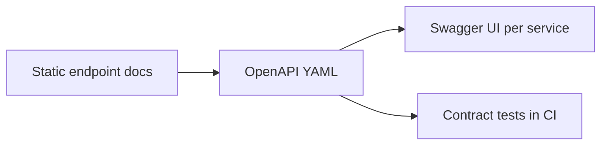

# API Reference

The services currently expose compact REST endpoints for account, payment, and
transaction workflows. The API surface will grow with request validation,
OpenAPI specs, examples, and generated reference pages.

The first OpenAPI contract sketch lives at
[`docs/api/openapi.yaml`](api/openapi.yaml). It documents the current scaffold
and gives future work a stable place to add examples, validation responses, and
contract-test coverage.

## Account Service

Base URL: `http://localhost:8081`

| Method | Path | Purpose |
| --- | --- | --- |
| `GET` | `/accounts` | List accounts |
| `POST` | `/accounts` | Create an account |

Example request:

```json
{
  "customerName": "Asha Mehta",
  "balance": 5000.00
}
```

## Payment Service

Base URL: `http://localhost:8082`

| Method | Path | Purpose |
| --- | --- | --- |
| `GET` | `/payments` | List payments |
| `POST` | `/payments` | Create a payment with a required `Idempotency-Key` header and durably queue its Kafka event |
| `POST` | `/internal/payment-outbox/{eventId}/recovery` | Re-arm an exhausted outbox event through restricted operator access |
| `GET` | `/internal/payment-outbox/dead-letter-handoffs` | Inspect bounded safe metadata for retained local handoffs |

`Idempotency-Key` accepts 1–128 visible ASCII characters. Repeating the same
key and request returns the original payment; reusing the key for different
payment details returns HTTP `409 Conflict`.

Payment status progresses through `CREATED`, `PENDING_RETRY`, `PUBLISHED`, or
terminal `PUBLISH_EXHAUSTED` as the outbox relay attempts Kafka publication.
Each committed terminal cycle also creates a local dead-letter handoff containing
safe failure metadata; it does not publish to a Kafka DLT.

Example request:

```json
{
  "fromAccount": 1,
  "toAccount": 2,
  "amount": 750.00
}
```

### Operator Authentication Modes

The two internal payment-outbox routes use exactly one configured authentication
mode. `basic` remains the default and uses the fail-closed local BCrypt operator.
`jwt` disables HTTP Basic and accepts only RS256 Bearer tokens validated against
an absolute HTTPS issuer, explicit JWK-set URI, exact audience, required `iat`
and `exp`, optional `nbf` when present, and a visible-ASCII `sub` of at most 100
characters. Time validation allows 60 seconds of clock skew. The JWT subject
becomes the recovery audit actor.

JWT scopes map narrowly to the existing route authorities:

| JWT scope | Granted authority | Route capability |
| --- | --- | --- |
| `payment.outbox.recovery` | `PAYMENT_OUTBOX_RECOVERY` | Submit an audited recovery command |
| `payment.outbox.handoff-inspection` | `PAYMENT_OUTBOX_HANDOFF_INSPECTION` | Read bounded local handoff metadata |

Scopes may use the standard space-delimited `scope` claim or `scp` collection.
Unknown scopes are ignored. A token without the route's exact scope receives
`403`; an invalid issuer, audience, time window, signature, or subject receives
`401`. Bearer tokens are never persisted or logged; only their validated `sub`
is retained as the recovery audit actor. Authentication mode is independent of
the operator transport mode described below.

### Operator Transport Modes

Operator transport defaults to `direct`. An active Basic or JWT operator then
requires `server.ssl.enabled=true`, and the request must arrive through the
application's HTTPS connector. Arbitrary `Forwarded` and `X-Forwarded-*`
headers do not satisfy this boundary.

An explicit `trusted-proxy` mode supports TLS termination at a reverse proxy:

```text
PAYMENT_RECOVERY_TRANSPORT_MODE=trusted-proxy
PAYMENT_RECOVERY_TRUSTED_PROXY_ADDRESSES=10.20.30.40,2001:db8::40
```

Only the two `/internal/payment-outbox/**` operator routes use this setting. An
insecure servlet request is treated as secure only when its immediate socket
peer exactly matches one configured numeric IPv4 or IPv6 address, it carries
one unambiguous `X-Forwarded-Proto: https` value, and it carries no `Forwarded`
header. Hostnames, CIDRs, duplicate addresses, comma-separated or repeated
protocol values, and IPv4-mapped IPv6 aliases are rejected. `X-Forwarded-For`,
`X-Forwarded-Host`, and `X-Forwarded-Port` are never used to establish trust.

`server.forward-headers-strategy` stays `none`; changing that setting stops an
active operator instead of enabling application-wide forwarding. The
trusted proxy must strip all client-supplied forwarding headers, add its own
single protocol header only after successful TLS, and be the only network peer
allowed to reach the clear-HTTP backend. The application cannot repair a proxy
that forwards attacker-controlled headers. Direct HTTPS remains valid in
trusted-proxy mode.

### Restricted Outbox Recovery

Endpoint URL: `https://localhost:8082/internal/payment-outbox/{eventId}/recovery`

The recovery endpoint requires `PAYMENT_OUTBOX_RECOVERY`. In Basic mode the
service creates no default operator: without a valid environment-supplied
username and BCrypt hash, authentication fails with HTTP `401`. In JWT mode a
validated token needs `payment.outbox.recovery`; its `sub` becomes the audit
actor. The request cannot choose or override either identity.

Request headers:

- `Authorization: Basic ...` in Basic mode, or `Authorization: Bearer ...` in
  JWT mode.
- `Idempotency-Key`: 16–128 visible ASCII characters. Use a new high-entropy
  value for each intended recovery command.

Request body:

```json
{
  "reason": "Kafka delivery was checked before requeue"
}
```

The reason is retained in the audit record. Never put credentials, tokens,
event payloads, personal data, or other secrets in this field.

Successful response:

```json
{
  "eventId": 7,
  "requeuedAt": "2026-09-11T05:30:00Z"
}
```

An exact command replay returns the original requeue time without resetting the
event again. On a secure request, missing or invalid inputs return `400`,
missing authentication returns `401`, insufficient authority returns `403`, an
unknown event returns `404`, and an ineligible event or conflicting command key
returns `409`. These business rejections are journaled before the response. The
journal stores only the requested event ID, a fixed rejection code, and a server
timestamp—never identity, command keys or hashes, reason/body, headers, payload,
payment/account data, or exception text. Validation, authentication,
authorization, insecure-request, and infrastructure failures are not business
rejection records. If the journal cannot be written, the original `404`/`409`
is withheld and the endpoint returns a generic `503` instead.
Responses never include the raw key, its digest, the stored event payload, the
reason, or persistence details. Neither Basic nor Bearer authentication replaces
transport security. Before authentication, the security filter rejects requests
that satisfy neither the direct-TLS boundary nor the explicit trusted-proxy
boundary. This repository does not add a TLS connector, clear-HTTP connector,
reverse proxy, firewall rule, or certificate.

### Restricted Dead-Letter Handoff Inspection

Endpoint URL:
`https://localhost:8082/internal/payment-outbox/dead-letter-handoffs`

The inspection route is HTTPS-only and requires
`PAYMENT_OUTBOX_HANDOFF_INSPECTION`. The configured local Basic operator has
both inspection and recovery authorities. JWT mode can grant only
`payment.outbox.handoff-inspection` to a read-only external identity.

Results are ordered by handoff id and bounded to 50 rows by default or 100 rows
at most. Pass the returned `nextCursor` as the next request's exclusive
`afterId`; a null cursor means no additional row was observed for that request,
although later terminal cycles can create newer handoffs. The endpoint reads
one extra scalar row only to determine whether another page exists and does not
run an unbounded list or total-count query.

Each item contains only handoff id, source event id, exhaustion sequence and
time, final attempt count, and a nullable safe exception class name. It excludes
topic, event key, payload, payment/account data, current outbox internals,
exception messages, recovery actor/reason/key data, and rejection-audit data.
The response proves local database staging only—not Kafka DLT publication,
external delivery, or downstream consumption.

## Transaction Service

Base URL: `http://localhost:8083`

| Method | Path | Purpose |
| --- | --- | --- |
| `GET` | `/transactions` | List transactions |
| `GET` | `/transactions/account/{id}` | List transactions involving an account |

## Contract Roadmap


