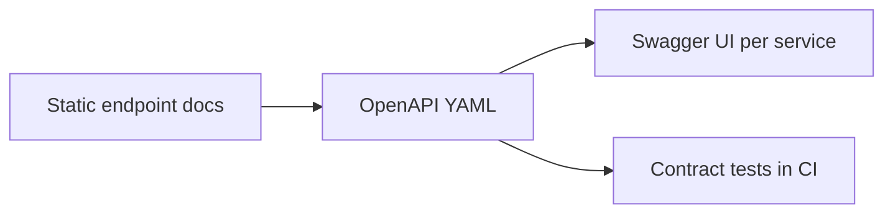

# API Reference

The services currently expose compact REST endpoints for account, payment, and
transaction workflows. The API surface will grow with request validation,
OpenAPI specs, examples, and generated reference pages.

The first OpenAPI contract sketch lives at
[`docs/api/openapi.yaml`](api/openapi.yaml). It documents the current scaffold
and gives future work a stable place to add examples, validation responses, and
contract-test coverage.

## Account Service

Base URL: `http://localhost:8081`

| Method | Path | Purpose |
| --- | --- | --- |
| `GET` | `/accounts` | List accounts |
| `POST` | `/accounts` | Create an account |

Example request:

```json
{
  "customerName": "Asha Mehta",
  "balance": 5000.00
}
```

## Payment Service

Base URL: `http://localhost:8082`

| Method | Path | Purpose |
| --- | --- | --- |
| `GET` | `/payments` | List payments |
| `POST` | `/payments` | Create a payment and publish a Kafka event |

Example request:

```json
{
  "fromAccount": 1,
  "toAccount": 2,
  "amount": 750.00
}
```

## Transaction Service

Base URL: `http://localhost:8083`

| Method | Path | Purpose |
| --- | --- | --- |
| `GET` | `/transactions` | List transactions |
| `GET` | `/transactions/account/{id}` | List transactions involving an account |

## Contract Roadmap


