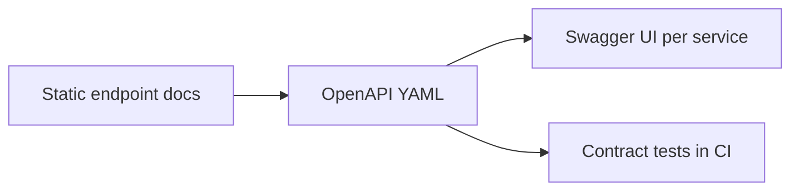

# API Reference

The services currently expose compact REST endpoints for account, payment, and
transaction workflows. The API surface will grow with request validation,
OpenAPI specs, examples, and generated reference pages.

The first OpenAPI contract sketch lives at
[`docs/api/openapi.yaml`](api/openapi.yaml). It documents the current scaffold
and gives future work a stable place to add examples, validation responses, and
contract-test coverage.

## Account Service

Base URL: `http://localhost:8081`

| Method | Path | Purpose |
| --- | --- | --- |
| `GET` | `/accounts` | List accounts |
| `POST` | `/accounts` | Create an account |

Example request:

```json
{
  "customerName": "Asha Mehta",
  "balance": 5000.00
}
```

## Payment Service

Base URL: `http://localhost:8082`

| Method | Path | Purpose |
| --- | --- | --- |
| `GET` | `/payments` | List payments |
| `POST` | `/payments` | Create a payment with a required `Idempotency-Key` header and durably queue its Kafka event |
| `POST` | `/internal/payment-outbox/{eventId}/recovery` | Re-arm an exhausted outbox event through restricted operator access |

`Idempotency-Key` accepts 1–128 visible ASCII characters. Repeating the same
key and request returns the original payment; reusing the key for different
payment details returns HTTP `409 Conflict`.

Payment status progresses through `CREATED`, `PENDING_RETRY`, `PUBLISHED`, or
terminal `PUBLISH_EXHAUSTED` as the outbox relay attempts Kafka publication.

Example request:

```json
{
  "fromAccount": 1,
  "toAccount": 2,
  "amount": 750.00
}
```

### Restricted Outbox Recovery

Endpoint URL: `https://localhost:8082/internal/payment-outbox/{eventId}/recovery`

The recovery endpoint uses HTTP Basic and requires the
`PAYMENT_OUTBOX_RECOVERY` authority. The service creates no default operator:
without a valid environment-supplied username and BCrypt hash, authentication
fails with HTTP `401`. Configured credentials are rejected at startup unless
the Spring Boot HTTPS connector is enabled. The authenticated username becomes
the audit actor; the request cannot choose or override it.

Request headers:

- `Authorization: Basic ...`
- `Idempotency-Key`: 16–128 visible ASCII characters. Use a new high-entropy
  value for each intended recovery command.

Request body:

```json
{
  "reason": "Kafka delivery was checked before requeue"
}
```

The reason is retained in the audit record. Never put credentials, tokens,
event payloads, personal data, or other secrets in this field.

Successful response:

```json
{
  "eventId": 7,
  "requeuedAt": "2026-09-11T05:30:00Z"
}
```

An exact command replay returns the original requeue time without resetting the
event again. On a secure request, missing or invalid inputs return `400`,
missing authentication returns `401`, insufficient authority returns `403`, an
unknown event returns `404`, and an ineligible event or conflicting command key
returns `409`.
Responses never include the raw key, its digest, the stored event payload, the
reason, or persistence details. HTTP Basic does not provide transport security.
The security filter rejects an insecure servlet request, and configured operator
credentials cannot activate unless `server.ssl.enabled` is true. A correctly
configured Spring Boot TLS connector is therefore required before the endpoint
can be used; this repository does not add a separate clear-HTTP connector, and
proxy-only TLS termination is not yet supported.

## Transaction Service

Base URL: `http://localhost:8083`

| Method | Path | Purpose |
| --- | --- | --- |
| `GET` | `/transactions` | List transactions |
| `GET` | `/transactions/account/{id}` | List transactions involving an account |

## Contract Roadmap


