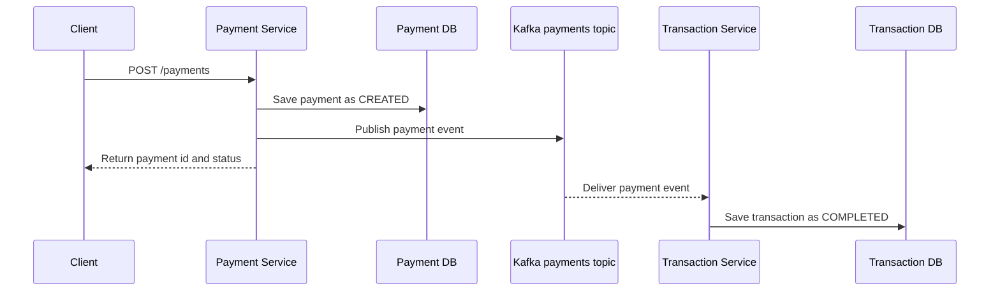
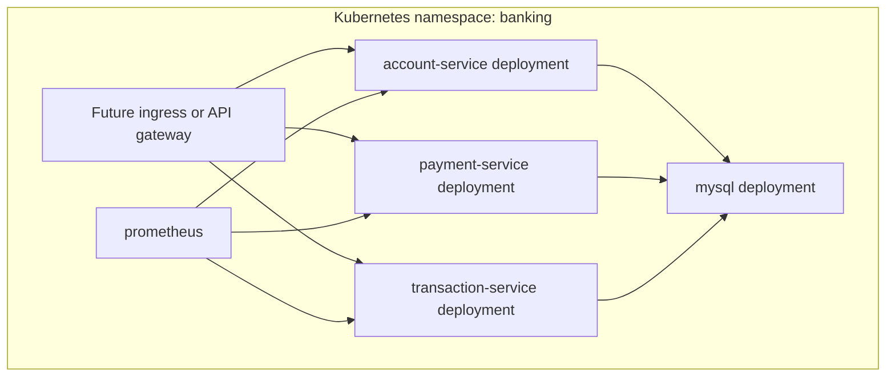
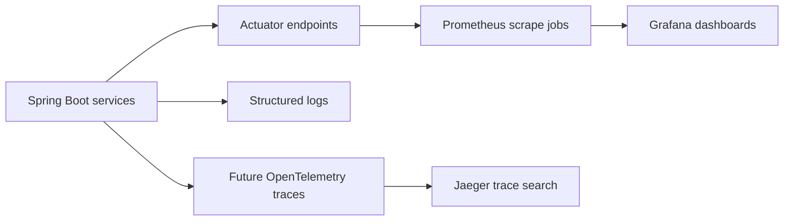

# Architecture

The system is organized around independent business capabilities. Each service
owns its runtime, API surface, persistence model, and operational metadata.

## Service Responsibilities

| Service | Owns | Publishes | Consumes |
| --- | --- | --- | --- |
| Account Service | Customer accounts and balances | None yet | None yet |
| Payment Service | Payment requests and status | `payments` Kafka events | None yet |
| Transaction Service | Transaction ledger entries | None yet | `payments` Kafka events |

## Payment Sequence

## Deployment Topology

## Observability View

The detailed signal plan is tracked in the
[observability guide](observability.md).

## Design Direction

The lab will evolve toward realistic service contracts, validation, error
handling, database migrations, resilience patterns, and documented operational
workflows while keeping each daily change reviewable.
