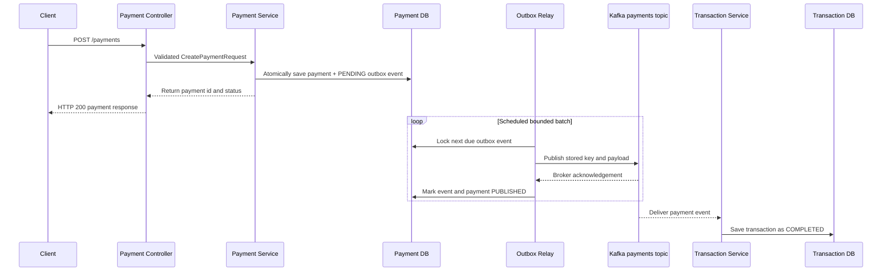
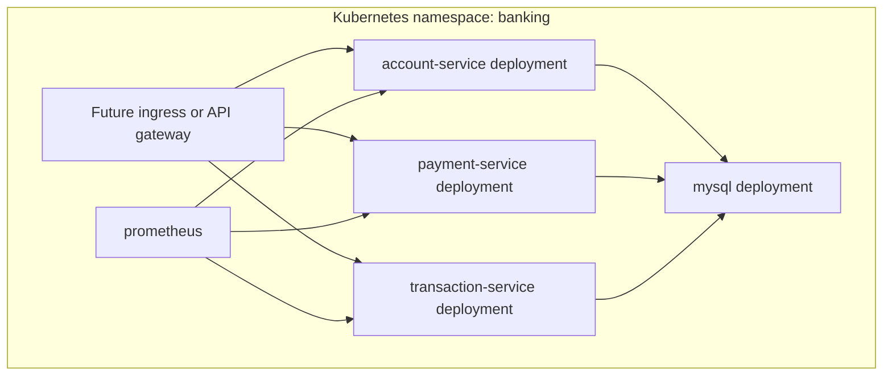
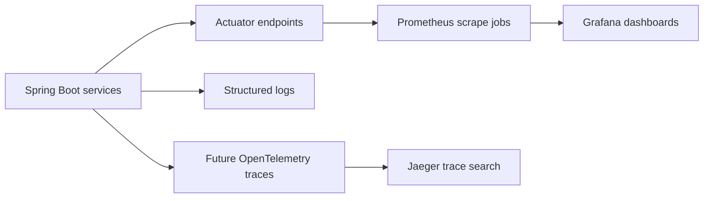

# Architecture

The system is organized around independent business capabilities. Each service
owns its runtime, API surface, persistence model, and operational metadata.

## Service Responsibilities

| Service | Owns | Publishes | Consumes |
| --- | --- | --- | --- |
| Account Service | Customer accounts and balances | None yet | None yet |
| Payment Service | Payment requests and status | `payments` Kafka events | None yet |
| Transaction Service | Transaction ledger entries | None yet | `payments` Kafka events |

## Payment Sequence

Payment and outbox insertion share one database transaction, so a committed new
payment always has a durable event to relay. The relay waits a bounded time for
broker acknowledgement and records either `PUBLISHED` or retry metadata. It
holds a pessimistic database lock while publishing so service instances do not
relay the same due row concurrently.

Delivery is at least once: a crash after Kafka acknowledgement but before the
database commit can cause a repeat publication. The transaction service's
payment-id uniqueness makes that repeat safe. Exponential backoff, terminal
failure handling, dead-letter routing, and outbox retention remain tracked in
the [resilience guide](resilience.md).

## Deployment Topology

## Observability View

The detailed signal plan is tracked in the
[observability guide](observability.md).

## Design Direction

The lab will evolve toward realistic service contracts, validation, error
handling, database migrations, resilience patterns, and documented operational
workflows while keeping each daily change reviewable.
