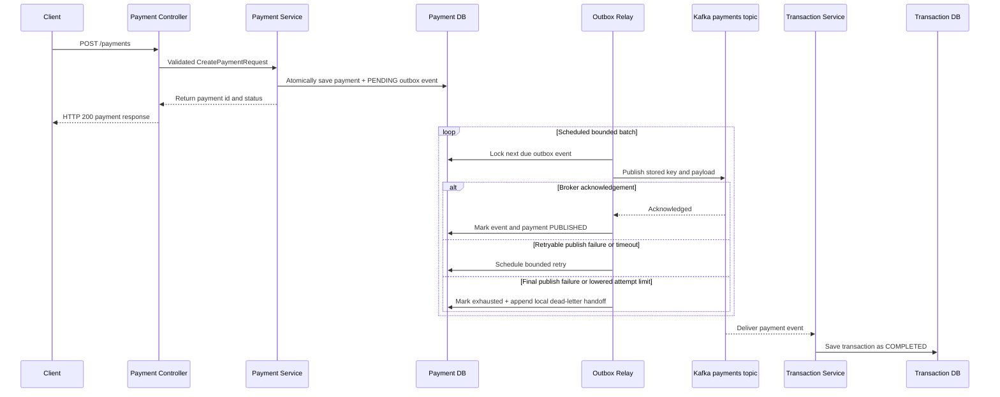
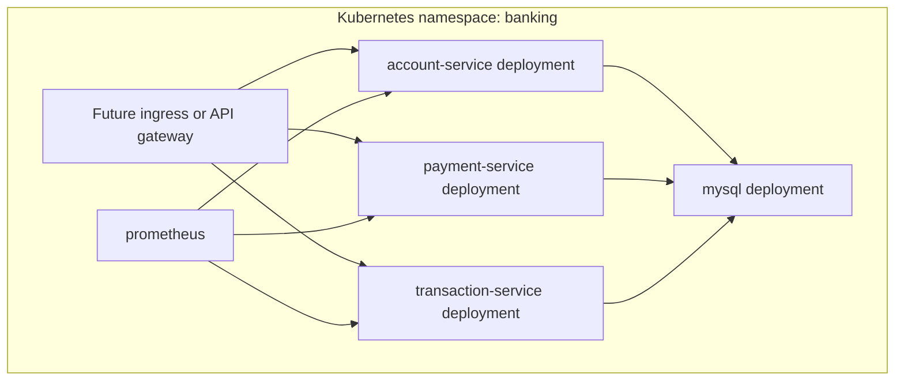
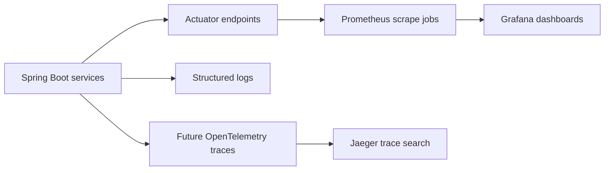

# Architecture

The system is organized around independent business capabilities. Each service
owns its runtime, API surface, persistence model, and operational metadata.

## Service Responsibilities

| Service | Owns | Publishes | Consumes |
| --- | --- | --- | --- |
| Account Service | Customer accounts and balances | None yet | None yet |
| Payment Service | Payment requests and status | `payments` Kafka events | None yet |
| Transaction Service | Transaction ledger entries | None yet | `payments` Kafka events |

## Payment Sequence

Payment and outbox insertion share one database transaction, so a committed new
payment always has a durable event to relay. The relay waits a bounded time for
broker acknowledgement and records either `PUBLISHED` or retry metadata. It
holds a pessimistic database lock while publishing so service instances do not
relay the same due row concurrently.

Delivery is at least once: a crash after Kafka acknowledgement but before the
database commit can cause a repeat publication. The transaction service's
payment-id uniqueness makes that repeat safe. Bounded exponential retry,
terminal relay exhaustion, and an internal row-locked, audited, idempotent
recovery command are implemented. A fail-closed operator adapter selects either
local HTTP Basic or external RS256 JWT authentication and accepts requests only
through an enabled HTTPS connector. The Basic username or validated JWT `sub`
becomes the successful-command audit actor. Known business rejections commit a
separate minimal journal containing only requested event id, fixed code, and
server time. Trusted-proxy support, real-IdP qualification, external dead-letter
delivery, and MySQL lock and retention qualification remain tracked in the
[resilience guide](resilience.md).

Each committed terminal publication cycle also appends an immutable local
dead-letter handoff in the same database transaction. It points to the retained
outbox event and snapshots only the exhaustion sequence, time, attempt count,
and safe failure type; it does not duplicate the event payload. Recovery keeps
the prior handoff as history, and a later terminal cycle appends a new one. This
is durable local staging, not proof that a Kafka DLT or any external consumer
received the event.

A separate HTTPS-only, read-only operator route exposes bounded scalar pages of
that safe handoff metadata. The query projects only handoff and source event ids,
cycle/time, attempt count, and sanitized failure type; it never loads the source
payload or payment/account data. A dedicated inspection authority is distinct
from recovery authority. The local Basic operator receives both; external JWT
identities can receive either capability through exact scopes.

An opt-in maintenance job bounds payment-database growth without changing the
relay path. It locks a limited set of strictly old `PUBLISHED` outbox rows,
deletes any successful recovery audits and local dead-letter handoffs that
reference them, then deletes the events in one transaction while preserving
the payment records. A separate limited batch removes old minimal
rejection-journal rows. Pending, retrying, and publication-exhausted events all
remain nonterminal `PENDING` rows and never qualify.

## Deployment Topology

## Observability View

The detailed signal plan is tracked in the
[observability guide](observability.md).

## Design Direction

The lab will evolve toward realistic service contracts, validation, error
handling, database migrations, resilience patterns, and documented operational
workflows while keeping each daily change reviewable.
