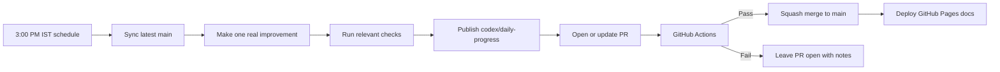

# Delivery

FinBank uses a daily automation loop to keep portfolio progress visible without
turning the repository into a stream of empty activity. Every run should produce
one focused, reviewable improvement.

## Daily Flow

## Quality Gates

| Change type | Expected verification |
| --- | --- |
| Java service code | `mvn -T 1C test` with JDK 17 |
| Documentation | `mkdocs build --strict` |
| CI or platform config | GitHub Actions result after PR publish |
| API contract | Documentation build plus review of examples |

## Commit Style

Daily commits should read like normal engineering progress:

- One cohesive topic per commit.
- Clear message describing the improvement.
- Verification notes in the pull request.
- No generated caches, local tools, build output, secrets, or fake changes.

## Merge Policy

The rolling branch is reusable. After checks pass, the daily PR can be squash
merged into `main`, which triggers the public documentation deployment. If checks
fail, the PR stays open so the failure is visible and fixable.
