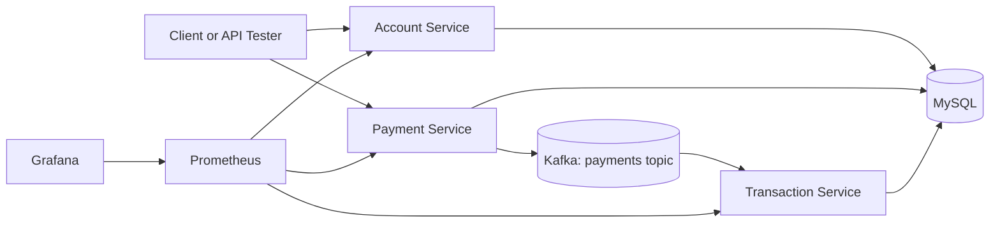

# FinBank Microservices Lab

FinBank is a cloud-native banking playground that demonstrates how core banking
capabilities can be split into focused Spring Boot services and operated with
modern platform tooling.

**Three focused services**

Accounts, payments, and transaction history are separated into independent
deployable units.

**Event-driven flow**

Payment creation publishes Kafka events that are consumed by the transaction
service.

**Platform ready**

Docker, Kubernetes manifests, Prometheus, Grafana, Jaeger, and CI/CD are part of
the roadmap.

## What This Shows

| Area | Portfolio signal |
| --- | --- |
| Backend engineering | REST APIs, JPA persistence, service boundaries |
| Distributed systems | Kafka-backed payment event flow |
| DevOps | Docker Compose, Kubernetes manifests, GitHub Actions |
| Observability | Actuator metrics, Prometheus, Grafana, Jaeger roadmap |
| Documentation | Live architecture portal with diagrams and runbooks |

## Current Status

This repository starts as a working scaffold and grows through daily, reviewable
pull requests. Each change is intended to be small enough to inspect and useful
enough to improve the project.

Follow the visible delivery history in the [progress log](progress-log.md).
