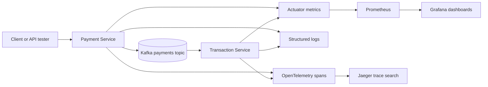
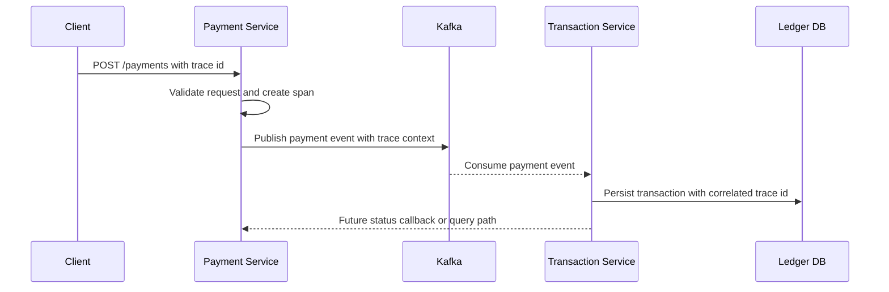

# Observability

FinBank treats observability as part of the service design, not an afterthought.
The goal is to make payment behavior, customer-facing latency, ledger outcomes,
and platform health easy to inspect from the first portfolio demo.

## Signal Ownership

| Signal | Owner | First useful view | Why it matters |
| --- | --- | --- | --- |
| HTTP latency | Every service | p95 latency by route and status | Shows customer impact and slow endpoints. |
| Payment state changes | Payment Service | Created, completed, failed, and retried payments | Makes the core business workflow visible. |
| Ledger writes | Transaction Service | Successful and failed transaction inserts | Confirms payment events become auditable entries. |
| Kafka consumer lag | Transaction Service | Lag by consumer group and topic | Detects delayed settlement or stuck consumers. |
| Database health | Platform | Connection pool usage and query errors | Catches saturation before requests fail. |
| Trace spans | All services | Cross-service payment timeline | Explains where a payment spent time. |

## Signal Flow

## Dashboard Slices

| Dashboard | Panels |
| --- | --- |
| Service Health | Uptime, request rate, error rate, p95 latency, JVM memory, thread count |
| Payment Flow | Payment creation rate, status distribution, event publish failures, retry count |
| Ledger Flow | Kafka lag, transaction insert rate, ledger write failures, duplicate event count |
| Platform | MySQL availability, connection pool usage, container restarts, CPU and memory |

## Alert Candidates

| Alert | Trigger | Severity |
| --- | --- | --- |
| Payment API error spike | 5xx rate above 2 percent for 10 minutes | High |
| Ledger consumer lag | Kafka lag grows for 15 minutes | High |
| Payment publish failure | Any sustained event publish failure | High |
| Database pool pressure | Pool usage above 85 percent for 10 minutes | Medium |
| Slow customer route | p95 latency above 750 ms for 15 minutes | Medium |

## Trace Roadmap

The next implementation step is to expose consistent actuator metrics in each
service and document the Prometheus scrape configuration alongside sample
Grafana panels.
