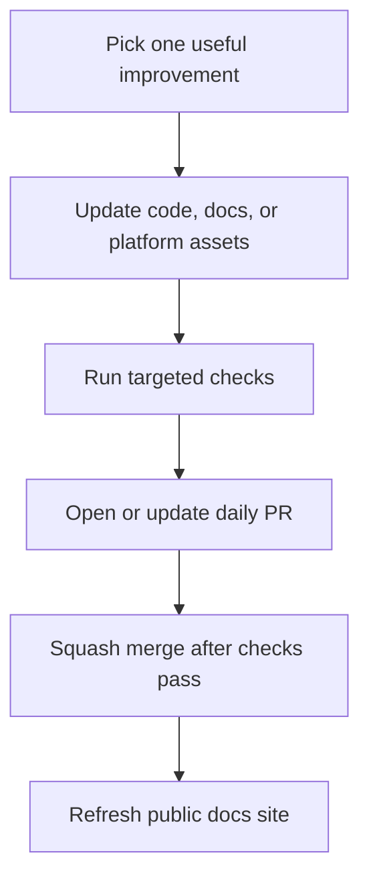

# Progress Log

This page records visible portfolio progress as the project grows through small,
reviewable changes. It is meant to make the automation's work easy to inspect
from the public documentation site, not just from the Git history.

## Delivery Rhythm

## Activity

| Date | Area | Visible improvement | Verification |
| --- | --- | --- | --- |
| 2026-05-27 | Foundation | Published the initial FinBank portfolio scaffold with MkDocs Material, architecture diagrams, and GitHub Pages deployment. | Docs build and Pages workflow |
| 2026-05-27 | API docs | Added the first OpenAPI-style contract sketch for account, payment, and transaction flows. | Docs build and PR checks |
| 2026-05-27 | Delivery | Documented the daily PR, verification, and squash-merge workflow. | Docs build and PR checks |
| 2026-05-29 | Documentation | Added this progress log so daily improvements are visible from the live documentation portal. | `mkdocs build --strict` |
| 2026-06-12 | Observability | Added an observability guide with signal ownership, dashboard slices, alert candidates, and trace flow diagrams. | `mkdocs build --strict` |
| 2026-06-12 | Resilience | Added payment resilience notes covering idempotency, retry boundaries, and failure handling. | `mkdocs build --strict` |
| 2026-08-27 | Payment API | Added a validated payment request contract with server-owned identity and status, plus no-side-effect rejection tests. | `mvn -T 1C test` |
| 2026-08-28 | Payment architecture | Moved payment persistence and the asynchronous Kafka send request behind a tested service boundary so the controller owns only HTTP concerns. | `mvn -T 1C clean test` |
| 2026-08-29 | Account API | Added a validated account creation contract and moved persistence behind a tested service boundary with server-owned identity. | `mvn -T 1C clean test` |
| 2026-08-30 | Account persistence | Added an H2-backed JPA slice test proving generated identity, persisted account fields, and service-level listing without Docker. | `mvn -T 1C clean test` |
| 2026-08-31 | Payment persistence | Added H2-backed JPA coverage proving generated payment identity, persisted state, service listing, and event payload construction without Docker. | `mvn -T 1C clean test` |
| 2026-09-01 | Transaction persistence | Added H2-backed JPA coverage proving generated transaction identity, timestamps, persisted fields, and source/destination account-history queries without Docker. | `mvn -T 1C clean test` |
| 2026-09-02 | Transaction architecture | Moved HTTP reads and payment-event ledger writes behind a tested service boundary, separated the Kafka listener, and made malformed events fail visibly instead of being silently discarded. | `mvn -T 1C clean test` |
| 2026-09-03 | Transaction idempotency | Persisted payment event identity, made exact redelivery idempotent, rejected conflicting reuse, added a database uniqueness guard, and aligned producer/consumer amount precision. | `mvn -T 1C clean test` |
| 2026-09-04 | Payment idempotency | Required an idempotency key, stored only its hash, returned exact retries without duplicate writes or event sends, rejected conflicting reuse, and guarded concurrent requests with database uniqueness. | `mvn -T 1C clean test` |
| 2026-09-07 | Payment outbox | Atomically queued payment events, added a scheduled acknowledged Kafka relay, persisted retry state, and protected concurrent publishers with row locking. | `mvn -T 1C clean test` |
| 2026-09-08 | Outbox retry policy | Added capped exponential retry, configurable maximum attempts, terminal publication-exhaustion state, and persisted exhaustion coverage. | `mvn -T 1C clean test` |
| 2026-09-09 | Outbox recovery | Added a transactional, row-locked internal recovery boundary that safely re-arms only exhausted events without exposing an unauthenticated operator endpoint. | `mvn -T 1C clean test` |
| 2026-09-10 | Outbox recovery command | Added atomic recovery audit records, hashed command keys, exact-command replay, conflict handling, and rollback coverage without exposing an HTTP endpoint. | `mvn -T 1C clean test` |
| 2026-09-11 | Recovery access control | Added an HTTPS-required, fail-closed HTTP Basic operator adapter with environment-supplied BCrypt credentials, principal-derived audit identity, safe receipts, and explicit route authorization. | `mvn -T 1C clean test` |
| 2026-09-15 | Recovery rejection audit | Added a separate journal for missing-event, ineligible-event, and command-conflict rejections containing only event id, fixed code, and server time; audit-write failure now returns a safe `503`. | `mvn -T 1C clean test` |
| 2026-09-16 | Outbox retention | Added opt-in, batch-limited cleanup for strictly old published outbox events and recovery journals, with foreign-key-safe deletion, rollback, cutoff, nonterminal-state, and payment-preservation coverage. | `mvn -T 1C clean test` |
| 2026-09-17 | Dead-letter handoff | Added one immutable, payload-free local handoff per committed terminal publication cycle, atomic rollback on handoff-write failure, multi-cycle recovery history, and retention-safe cleanup. | `mvn -T 1C clean test` |
| 2026-09-18 | Handoff inspection | Added an HTTPS-only, inspection-authority-protected GET route with bounded keyset pagination and scalar safe-field projections that never load source payload or payment/account data. | `mvn -T 1C clean test` |
| 2026-09-21 | External operator identity | Added mutually exclusive Basic/JWT authentication, RS256 issuer/audience/time/subject validation, exact recovery and inspection scope mapping, safe Bearer failures, and JWT-subject audit attribution. | `mvn -T 1C clean test` |
| 2026-09-22 | Trusted proxy transport | Added opt-in, operator-route-only proxy TLS recognition using exact immediate-peer IPs and one canonical HTTPS protocol header, while preserving direct TLS and rejecting ambiguous or global forwarding. | `mvn -T 1C clean test` |
| 2026-09-23 | API Explorer | Added a locally vendored, read-only Swagger UI using a generated credential-free public projection of the canonical contract, corrected per-service server mappings, added stable operation IDs, and made strict docs builds validate OpenAPI semantics and viewer integrity offline. | `mkdocs build --strict` |
| 2026-09-24 | Public API examples | Added schema-validated synthetic success examples for all six public operations, clarified response-model fields, and extended the docs gate to reject invalid, external, or selected known-sensitive example fields. | `mkdocs build --strict` |

## Upcoming Focus

| Track | Next useful increment |
| --- | --- |
| Backend | Standardize public validation and idempotency-conflict errors as Problem Details. |
| Quality | Qualify recovery persistence and lock contention against MySQL. |
| Platform | Tighten Docker Compose health checks and environment defaults. |
| Observability | Add a metrics and tracing overview with dashboard examples. |
| Resilience | Add independently available dead-letter delivery after the held platform work is released. |

## Review Standard

Each entry should represent a real improvement that can be reviewed on its own.
The project should avoid empty commits, generated caches, local tool folders,
logs, secrets, and unrelated formatting churn.
