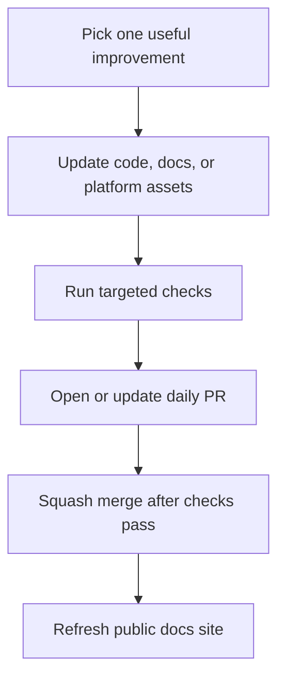

# Progress Log

This page records visible portfolio progress as the project grows through small,
reviewable changes. It is meant to make the automation's work easy to inspect
from the public documentation site, not just from the Git history.

## Delivery Rhythm

## Activity

| Date | Area | Visible improvement | Verification |
| --- | --- | --- | --- |
| 2026-05-27 | Foundation | Published the initial FinBank portfolio scaffold with MkDocs Material, architecture diagrams, and GitHub Pages deployment. | Docs build and Pages workflow |
| 2026-05-27 | API docs | Added the first OpenAPI-style contract sketch for account, payment, and transaction flows. | Docs build and PR checks |
| 2026-05-27 | Delivery | Documented the daily PR, verification, and squash-merge workflow. | Docs build and PR checks |
| 2026-05-29 | Documentation | Added this progress log so daily improvements are visible from the live documentation portal. | `mkdocs build --strict` |
| 2026-06-12 | Observability | Added an observability guide with signal ownership, dashboard slices, alert candidates, and trace flow diagrams. | `mkdocs build --strict` |
| 2026-06-12 | Resilience | Added payment resilience notes covering idempotency, retry boundaries, and failure handling. | `mkdocs build --strict` |
| 2026-08-27 | Payment API | Added a validated payment request contract with server-owned identity and status, plus no-side-effect rejection tests. | `mvn -T 1C test` |
| 2026-08-28 | Payment architecture | Moved payment persistence and the asynchronous Kafka send request behind a tested service boundary so the controller owns only HTTP concerns. | `mvn -T 1C clean test` |
| 2026-08-29 | Account API | Added a validated account creation contract and moved persistence behind a tested service boundary with server-owned identity. | `mvn -T 1C clean test` |
| 2026-08-30 | Account persistence | Added an H2-backed JPA slice test proving generated identity, persisted account fields, and service-level listing without Docker. | `mvn -T 1C clean test` |
| 2026-08-31 | Payment persistence | Added H2-backed JPA coverage proving generated payment identity, persisted state, service listing, and event payload construction without Docker. | `mvn -T 1C clean test` |
| 2026-09-01 | Transaction persistence | Added H2-backed JPA coverage proving generated transaction identity, timestamps, persisted fields, and source/destination account-history queries without Docker. | `mvn -T 1C clean test` |
| 2026-09-02 | Transaction architecture | Moved HTTP reads and payment-event ledger writes behind a tested service boundary, separated the Kafka listener, and made malformed events fail visibly instead of being silently discarded. | `mvn -T 1C clean test` |
| 2026-09-03 | Transaction idempotency | Persisted payment event identity, made exact redelivery idempotent, rejected conflicting reuse, added a database uniqueness guard, and aligned producer/consumer amount precision. | `mvn -T 1C clean test` |

## Upcoming Focus

| Track | Next useful increment |
| --- | --- |
| Backend | Add idempotency-key handling for payment creation. |
| Quality | Define Kafka retry/dead-letter policy and test transient persistence failures. |
| Platform | Tighten Docker Compose health checks and environment defaults. |
| Observability | Add a metrics and tracing overview with dashboard examples. |
| Resilience | Add idempotency-key handling and duplicate payment request tests. |

## Review Standard

Each entry should represent a real improvement that can be reviewed on its own.
The project should avoid empty commits, generated caches, local tool folders,
logs, secrets, and unrelated formatting churn.
