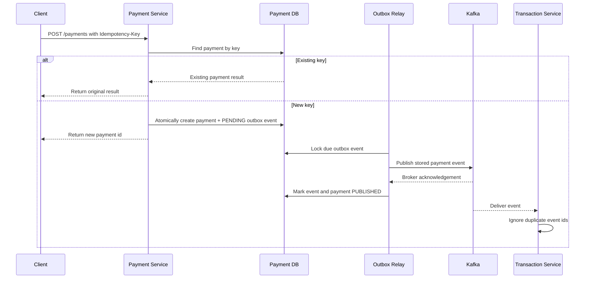

# Resilience

FinBank's payment path should protect customers from duplicate charges, partial
processing, and unclear failure states. This page defines the first resilience
rules before they are implemented in service code.

## Payment Resilience Goals

| Goal | Rule | First implementation target |
| --- | --- | --- |
| Prevent duplicate charges | Require an idempotency key for payment creation. | Implemented at the Payment API boundary |
| Make retries safe | Return the original payment result when the same key is repeated. | Implemented with a non-raw SHA-256 key digest and database uniqueness |
| Keep ledger writes consistent | Process each payment event once per payment id. | Implemented with persisted payment identity and database uniqueness |
| Expose recoverable failures | Distinguish validation, downstream, and retryable failures. | API error model and status field |
| Preserve auditability | Store request key, payment id, event id, and ledger id together. | Payment and transaction persistence |

## Idempotent Payment Flow

## Retry Boundaries

| Boundary | Current behavior | Remaining work |
| --- | --- | --- |
| Client to Payment Service | Exact retries return the original result through the idempotency key. | Define key expiry and retention. |
| Payment Service to database | The request fails visibly when its atomic payment/outbox transaction fails. | Add bounded transient database retry only after failure classification exists. |
| Payment outbox to Kafka | A scheduled relay waits for acknowledgement and retries failures after a fixed delay. | Add exponential backoff, maximum attempts, and terminal failure handling. |
| Transaction Service consumer | Malformed or persistence failures reach the Kafka container; duplicate payment events are safe. | Configure bounded backoff and dead-letter routing. |

## Transaction Event Idempotency

The transaction service stores the originating payment id with every new ledger
entry. An exact Kafka redelivery returns the existing entry without writing a
second row. Reusing the same payment id with different account or amount data
fails as a conflict. A database unique constraint protects concurrent consumers;
the losing writer re-reads and accepts only the matching entry. Kafka retry and
dead-letter policy remain separate planned work. Payment creation and event
consumption share a two-decimal amount contract so an accepted payment cannot
later fail ledger validation because of database rounding.

## Payment Request Idempotency

`POST /payments` requires an opaque, case-sensitive `Idempotency-Key`. The
service stores only its SHA-256 hash, avoiding raw-key disclosure and database
collation differences. This unkeyed digest is not protection for a predictable
key if the database is exposed, so clients should generate high-entropy keys.
An exact retry returns the original payment without a
second insert or Kafka send request. Reusing a key for different account or
amount data returns HTTP `409 Conflict`; a database unique constraint also
protects concurrent requests.

New payment creation atomically commits the payment and one `PENDING` outbox
event. A scheduled relay publishes the stored event key and payload, waits for a
bounded broker acknowledgement, and records `PUBLISHED` or `PENDING_RETRY` state.
This removes the database-success/process-crash gap that existed when the
service sent directly after committing the payment.

Publication remains at least once. A timeout, or a crash after broker
acknowledgement but before the outbox status commit, can cause a duplicate send.
The transaction service's payment-id uniqueness accepts identical redelivery
without a second ledger row. The current relay uses a fixed delay and retains
all outbox rows; maximum attempts, terminal failure, dead-letter routing, and
retention remain future work.

## Failure States

| State | Meaning | Operator action |
| --- | --- | --- |
| `CREATED` | Payment accepted and awaiting event processing. | Watch for stuck records older than the SLA. |
| `PUBLISHED` | Payment event was acknowledged by Kafka. | Confirm consumer lag remains low. |
| `COMPLETED` | Ledger entry was written successfully. | No action required. |
| `PENDING_RETRY` | A retryable dependency failed. | Review retry queue and dependency health. |
| `FAILED` | A non-retryable validation or processing error occurred. | Expose a clear client-facing error and audit trail. |

## Implementation Checklist

- [x] Require an `Idempotency-Key` header for payment creation.
- [x] Persist a non-raw key digest with the payment result and enforce uniqueness.
- [x] Add duplicate event detection in the transaction service.
- [x] Add tests for repeated payment requests with the same key.
- [x] Add a transactional outbox for recoverable payment event publication.
- Add bounded exponential retry, terminal failure, and dead-letter routing.
- Add dashboard panels for retry count, duplicate events, and stuck payments.
