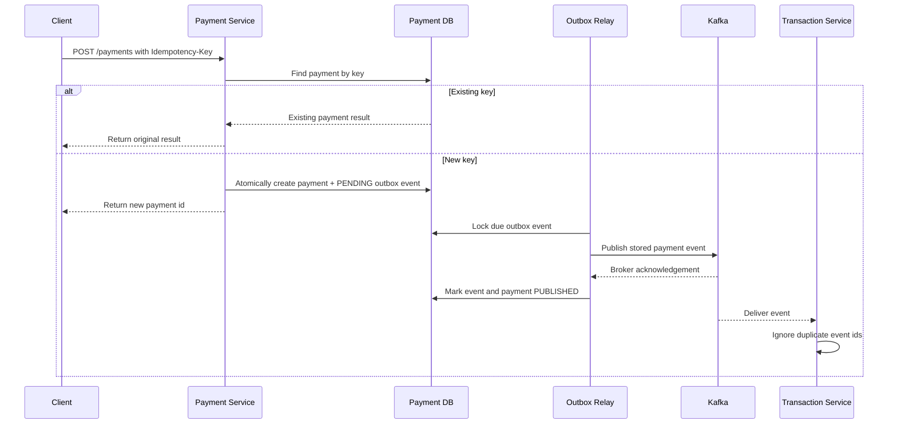

# Resilience

FinBank's payment path should protect customers from duplicate charges, partial
processing, and unclear failure states. This page defines the first resilience
rules before they are implemented in service code.

## Payment Resilience Goals

| Goal | Rule | First implementation target |
| --- | --- | --- |
| Prevent duplicate charges | Require an idempotency key for payment creation. | Implemented at the Payment API boundary |
| Make retries safe | Return the original payment result when the same key is repeated. | Implemented with a non-raw SHA-256 key digest and database uniqueness |
| Keep ledger writes consistent | Process each payment event once per payment id. | Implemented with persisted payment identity and database uniqueness |
| Expose recoverable failures | Distinguish validation, downstream, and retryable failures. | API error model and status field |
| Preserve auditability | Store request key, payment id, event id, and ledger id together. | Payment and transaction persistence |

## Idempotent Payment Flow

## Retry Boundaries

| Boundary | Current behavior | Remaining work |
| --- | --- | --- |
| Client to Payment Service | Exact retries return the original result through the idempotency key. | Define key expiry and retention. |
| Payment Service to database | The request fails visibly when its atomic payment/outbox transaction fails. | Add bounded transient database retry only after failure classification exists. |
| Payment outbox to Kafka | A scheduled relay waits for acknowledgement, uses capped exponential delays, stops after five failed sends by default, atomically stages a local dead-letter handoff, supports restricted inspection and audited recovery, and has opt-in bounded retention. | Add independently available delivery and MySQL qualification. |
| Transaction Service consumer | Malformed or persistence failures reach the Kafka container; duplicate payment events are safe. | Configure bounded backoff and dead-letter routing. |

## Transaction Event Idempotency

The transaction service stores the originating payment id with every new ledger
entry. An exact Kafka redelivery returns the existing entry without writing a
second row. Reusing the same payment id with different account or amount data
fails as a conflict. A database unique constraint protects concurrent consumers;
the losing writer re-reads and accepts only the matching entry. Kafka retry and
dead-letter policy remain separate planned work. Payment creation and event
consumption share a two-decimal amount contract so an accepted payment cannot
later fail ledger validation because of database rounding.

## Payment Request Idempotency

`POST /payments` requires an opaque, case-sensitive `Idempotency-Key`. The
service stores only its SHA-256 hash, avoiding raw-key disclosure and database
collation differences. This unkeyed digest is not protection for a predictable
key if the database is exposed, so clients should generate high-entropy keys.
An exact retry returns the original payment without a
second insert or Kafka send request. Reusing a key for different account or
amount data returns HTTP `409 Conflict`; a database unique constraint also
protects concurrent requests.

New payment creation atomically commits the payment and one `PENDING` outbox
event. A scheduled relay publishes the stored event key and payload, waits for a
bounded broker acknowledgement, and records `PUBLISHED` or `PENDING_RETRY` state.
This removes the database-success/process-crash gap that existed when the
service sent directly after committing the payment.

Publication remains at least once. A timeout, or a crash after broker
acknowledgement but before the outbox status commit, can cause a duplicate send.
The transaction service's payment-id uniqueness accepts identical redelivery
without a second ledger row. The relay retains all outbox rows while the
opt-in retention job is disabled. Local dead-letter staging is implemented;
external delivery remains future work.

## Bounded Outbox Retry

The default policy makes five total broker send attempts. After failed attempt
`n`, the next delay is `min(5 seconds × 2^(n-1), 5 minutes)`. Delay timing starts
when the failure is observed, so time spent waiting for the broker does not make
the next attempt immediately due. Both the base delay, cap, and maximum attempts
are configurable.

| Property | Default | Purpose |
| --- | ---: | --- |
| `payment.outbox.retry-delay-ms` | 5000 | First retry delay |
| `payment.outbox.max-retry-delay-ms` | 300000 | Exponential delay cap |
| `payment.outbox.max-attempts` | 5 | Total send attempts, including the initial attempt |
| `payment.outbox.send-timeout-ms` | 5000 | Maximum acknowledgement wait per attempt |

When the final attempt fails, the outbox row receives an exhaustion timestamp,
the payment moves to `PUBLISH_EXHAUSTED`, and the row is excluded from normal
polling. This means the relay exhausted its policy; it does not prove Kafka never
accepted the event because a timeout can be ambiguous. The stored error is only
the exception type so broker messages do not leak secrets. The restricted
operator adapter can re-arm an exhausted event.

## Durable Local Dead-Letter Handoff

Every committed transition to terminal publication exhaustion appends one
immutable handoff row in the same transaction as the exhausted outbox and
payment states. The handoff references the retained source event and snapshots
only its monotonically increasing exhaustion sequence, exhaustion time, final
attempt count, and safe exception type. It does not duplicate the topic, key,
payload, payment details, account data, or exception message. A database unique
constraint on event and exhaustion sequence prevents duplicate staging of one
terminal cycle.

If handoff persistence fails, the terminal outbox and payment state roll back
with it. The attempted Kafka send cannot be undone, so a later retry may still
duplicate a delivery; the transaction service's payment-id uniqueness remains
the downstream protection. Recovery keeps earlier handoffs as immutable
incident history. If a recovered event exhausts again, the source sequence
increments and a second handoff is appended.

This is local durable staging, not a Kafka DLT send or an external delivery
receipt. Sending to the same unavailable Kafka cluster would share the original
failure dependency. A future relay must use an independently qualified
destination, persist its own acknowledgement state, and receive end-to-end
broker testing after platform work is released.

Operators can inspect retained handoffs through a separate HTTPS-only GET route
using `PAYMENT_OUTBOX_HANDOFF_INSPECTION`. It returns bounded scalar projections
ordered by handoff id with an exclusive cursor; no entity graph, payload, event
key, topic, payment/account data, exception message, or recovery metadata is
returned. The current configured local Basic operator receives both inspection
and recovery authorities, while external JWT identities can receive either
capability through exact scopes.

## Internal Audited, Idempotent Recovery Command

The payment service has an internal command for recovering an exhausted outbox
row. It validates command metadata, stores only a SHA-256 digest of the opaque
recovery key, locks the row, and verifies that both the outbox and payment are
in the matching exhaustion state. One transaction then clears the exhaustion
marker, resets the per-cycle attempt count, makes the unchanged event due, and
appends a successful recovery audit row. The audit captures the caller-supplied
actor and reason plus the prior exhaustion time, attempt count, and safe error
type. The recovery state and audit either commit or roll back together.

Recovery itself never calls Kafka. The normal outbox publisher performs the new
attempt after the recovery transaction commits, preserving the same locking,
acknowledgement, and retry rules. Repeating the exact command key and metadata
returns its original audit record without resetting a later attempt. Reusing a
key for another event, actor, or reason fails as a command conflict. Requeueing
authorizes another idempotent delivery attempt; it does not claim that the
earlier timed-out delivery failed.

A restricted HTTP adapter selects exactly one operator authentication mode.
Basic mode remains the default and is fail-closed: no default account is
created, both the username and a Spring-style BCrypt hash must come from the
runtime environment, and partial or invalid configuration stops startup. JWT
mode disables Basic, rejects local credentials, and accepts only RS256 tokens
validated against absolute HTTPS issuer and JWK-set URIs, exact audience,
required `iat` and `exp`, optional `nbf`, and a visible-ASCII subject no longer
than 100 characters. Time validation allows 60 seconds of clock skew, and scopes
may come from the standard `scope` string or `scp` collection.
Only `payment.outbox.recovery` and `payment.outbox.handoff-inspection` scopes map
to their matching authorities; every other scope is ignored.

The Basic username or validated JWT `sub` becomes the audit actor, so an HTTP
request cannot supply or override that identity. Bearer tokens are never stored
or logged. The response includes only the event id and original requeue time; it
excludes command keys, hashes, reasons, event data, and persistence details.
Because the reason is retained in the audit table, it must never contain
credentials, tokens, payloads, personal data, or secrets.
Public payment routes plus health, info, and monitoring paths remain
allowlisted. Apart from the framework `/error` dispatch, unlisted
payment-service paths are denied.

Transport defaults to direct TLS: an active Basic or JWT operator then requires
`server.ssl.enabled=true` and a secure servlet request. Opt-in trusted-proxy mode
also accepts clear-HTTP requests to the two operator routes when the immediate
peer exactly matches a configured numeric IP, there is exactly one
`X-Forwarded-Proto: https` value, and no `Forwarded` header is present. The
route-scoped filter ignores forwarding data for public and monitoring routes,
never derives trust from `X-Forwarded-For`, and still accepts direct HTTPS.
`server.forward-headers-strategy` remains pinned to `none`; an active operator
refuses startup if that setting is changed.
The proxy must strip client forwarding headers, set the canonical protocol value
after TLS termination, and be the only network peer able to reach the backend.
Network exposure, TLS material, IdP/JWK availability and rotation, and real-token
end-to-end validation remain deployment responsibilities. Immutability is not a
database permission boundary, and external dead-letter delivery plus MySQL
persistence, locking, and retention qualification remain pending.

### Minimal Business-Rejection Journal

After authentication and request validation succeed, three known business
rejections are journaled: missing event, event not eligible, and recovery-command
conflict. Any recovery transaction has already committed or rolled back—or the
conflict was found before one started—when a separate transaction stores only
the requested event id, a fixed rejection code, and the server rejection time.
It intentionally has no event foreign key so a missing-event rejection can be
retained.

The rejection journal does not store actor identity, raw or hashed command key,
reason/body, headers, payload or event key, payment/account data, status or
attempt details, or exception text. Validation, authentication, authorization,
insecure-request, and unexpected infrastructure failures are outside this
business journal. If a known rejection cannot be journaled, the service returns
a generic `503 Service Unavailable` instead of disclosing the original `404` or
`409`; the rejected attempt commits no recovery state change.

## Bounded Outbox Retention

Retention is disabled by default because deleting audit history is an explicit
operational policy choice. When enabled, one scheduled run locks at most the
configured batch size of outbox rows in `PUBLISHED` state whose `publishedAt`
timestamp is strictly older than the configured cutoff. Pending, retrying, and
publication-exhausted work all remains in the nonterminal `PENDING` state and
never qualifies. The associated payment record is also preserved.

Successful recovery audits have a foreign key to their outbox event. The job
therefore deletes all successful recovery audits and local dead-letter handoffs
for a claimed published event before deleting that event, in the same
transaction. A parent-delete failure rolls both child deletions back. Minimal
business-rejection audits have no event foreign key, so the job locks and
removes a separate batch based on `rejectedAt`. Exact recovery-command replay
history and dead-letter cycle history are available only while their published
source event is retained.

| Property | Default | Purpose |
| --- | ---: | --- |
| `payment.outbox.retention.enabled` | `false` | Explicitly activates destructive cleanup |
| `payment.outbox.retention.published-retention-days` | 30 | Age required for a published event and its recovery and dead-letter history |
| `payment.outbox.retention.rejection-retention-days` | 30 | Age required for a minimal rejection-journal row |
| `payment.outbox.retention.batch-size` | 100 | Maximum published-event candidates and rejection rows claimed per run |
| `payment.outbox.retention.cleanup-delay-ms` | 86400000 | Delay between completed cleanup runs |

Retention controls local storage only. Kafka acknowledgement does not prove
that every consumer completed, and cleanup does not change at-least-once
delivery or provide dead-letter routing. The H2 persistence suite proves strict
cutoff handling, foreign-key-safe deletion, transaction rollback, batch caps,
payment preservation, and protection of nonterminal rows. MySQL locking and
schema-migration qualification remain separate work; relying on
`ddl-auto=update` is not a production migration strategy.

## Failure States

| State | Meaning | Operator action |
| --- | --- | --- |
| `CREATED` | Payment accepted and awaiting event processing. | Watch for stuck records older than the SLA. |
| `PUBLISHED` | Payment event was acknowledged by Kafka. | Confirm consumer lag remains low. |
| `COMPLETED` | Ledger entry was written successfully. | No action required. |
| `PENDING_RETRY` | A retryable dependency failed. | Review retry queue and dependency health. |
| `PUBLISH_EXHAUSTED` | The outbox exhausted its publication attempts, and a local dead-letter handoff was staged; delivery may still be unknown. | Inspect the handoff, Kafka, and ledger state before issuing the internal recovery command. |

## Implementation Checklist

- [x] Require an `Idempotency-Key` header for payment creation.
- [x] Persist a non-raw key digest with the payment result and enforce uniqueness.
- [x] Add duplicate event detection in the transaction service.
- [x] Add tests for repeated payment requests with the same key.
- [x] Add a transactional outbox for recoverable payment event publication.
- [x] Add bounded exponential retry and terminal relay exhaustion handling.
- [x] Add an internal locked, audited, idempotent recovery command for exhausted events.
- [x] Add a fail-closed HTTP Basic operator adapter with principal-derived audit identity.
- [x] Journal known business rejections without sensitive request or identity data.
- [x] Add opt-in bounded retention for old published outbox and recovery-audit data.
- [x] Add an atomic, payload-free local dead-letter handoff for terminal publication cycles.
- [x] Add HTTPS-only, bounded, safe operator inspection for retained handoffs.
- [x] Add mutually exclusive external RS256 JWT identity with issuer, audience, subject, and scope validation.
- [x] Add route-scoped trusted-proxy HTTPS scheme support for operator routes.
- Add independently available delivery and MySQL qualification.
- Add dashboard panels for retry count, duplicate events, and stuck payments.
