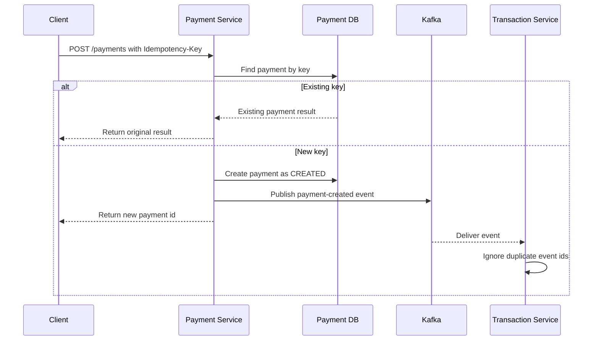

# Resilience

FinBank's payment path should protect customers from duplicate charges, partial
processing, and unclear failure states. This page defines the first resilience
rules before they are implemented in service code.

## Payment Resilience Goals

| Goal | Rule | First implementation target |
| --- | --- | --- |
| Prevent duplicate charges | Require an idempotency key for payment creation. | Payment Service request validation |
| Make retries safe | Return the original payment result when the same key is repeated. | Payment lookup by idempotency key |
| Keep ledger writes consistent | Process each payment event once per payment id. | Implemented with persisted payment identity and database uniqueness |
| Expose recoverable failures | Distinguish validation, downstream, and retryable failures. | API error model and status field |
| Preserve auditability | Store request key, payment id, event id, and ledger id together. | Payment and transaction persistence |

## Idempotent Payment Flow

## Retry Boundaries

| Boundary | Retry policy | Stop condition |
| --- | --- | --- |
| Client to Payment Service | Client may retry with the same idempotency key. | Original result is returned or request expires. |
| Payment Service to database | Service retries short transient connection failures. | Database confirms write or returns non-retryable error. |
| Payment Service to Kafka | Service retries publish failures before marking payment pending. | Event is acknowledged or payment enters recovery state. |
| Transaction Service consumer | Consumer retries event processing with backoff. | Ledger write succeeds or event is sent to dead-letter handling. |

## Transaction Event Idempotency

The transaction service stores the originating payment id with every new ledger
entry. An exact Kafka redelivery returns the existing entry without writing a
second row. Reusing the same payment id with different account or amount data
fails as a conflict. A database unique constraint protects concurrent consumers;
the losing writer re-reads and accepts only the matching entry. Kafka retry and
dead-letter policy remain separate planned work. Payment creation and event
consumption share a two-decimal amount contract so an accepted payment cannot
later fail ledger validation because of database rounding.

## Failure States

| State | Meaning | Operator action |
| --- | --- | --- |
| `CREATED` | Payment accepted and awaiting event processing. | Watch for stuck records older than the SLA. |
| `PUBLISHED` | Payment event was acknowledged by Kafka. | Confirm consumer lag remains low. |
| `COMPLETED` | Ledger entry was written successfully. | No action required. |
| `PENDING_RETRY` | A retryable dependency failed. | Review retry queue and dependency health. |
| `FAILED` | A non-retryable validation or processing error occurred. | Expose a clear client-facing error and audit trail. |

## Implementation Checklist

- Add an `Idempotency-Key` header requirement to payment creation.
- Persist idempotency key, payment id, request hash, and final result.
- [x] Add duplicate event detection in the transaction service.
- Add tests for repeated payment requests with the same key.
- Add dashboard panels for retry count, duplicate events, and stuck payments.
