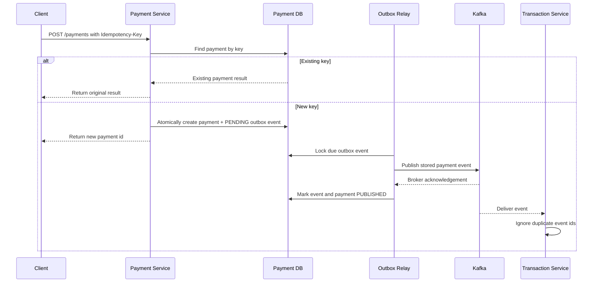

# Resilience

FinBank's payment path should protect customers from duplicate charges, partial
processing, and unclear failure states. This page defines the first resilience
rules before they are implemented in service code.

## Payment Resilience Goals

| Goal | Rule | First implementation target |
| --- | --- | --- |
| Prevent duplicate charges | Require an idempotency key for payment creation. | Implemented at the Payment API boundary |
| Make retries safe | Return the original payment result when the same key is repeated. | Implemented with a non-raw SHA-256 key digest and database uniqueness |
| Keep ledger writes consistent | Process each payment event once per payment id. | Implemented with persisted payment identity and database uniqueness |
| Expose recoverable failures | Distinguish validation, downstream, and retryable failures. | API error model and status field |
| Preserve auditability | Store request key, payment id, event id, and ledger id together. | Payment and transaction persistence |

## Idempotent Payment Flow

## Retry Boundaries

| Boundary | Current behavior | Remaining work |
| --- | --- | --- |
| Client to Payment Service | Exact retries return the original result through the idempotency key. | Define key expiry and retention. |
| Payment Service to database | The request fails visibly when its atomic payment/outbox transaction fails. | Add bounded transient database retry only after failure classification exists. |
| Payment outbox to Kafka | A scheduled relay waits for acknowledgement, uses capped exponential delays, stops after five failed sends by default, and supports an audited command through a restricted operator adapter. | Add rejected-attempt audit, dead-letter routing, retention, and MySQL qualification. |
| Transaction Service consumer | Malformed or persistence failures reach the Kafka container; duplicate payment events are safe. | Configure bounded backoff and dead-letter routing. |

## Transaction Event Idempotency

The transaction service stores the originating payment id with every new ledger
entry. An exact Kafka redelivery returns the existing entry without writing a
second row. Reusing the same payment id with different account or amount data
fails as a conflict. A database unique constraint protects concurrent consumers;
the losing writer re-reads and accepts only the matching entry. Kafka retry and
dead-letter policy remain separate planned work. Payment creation and event
consumption share a two-decimal amount contract so an accepted payment cannot
later fail ledger validation because of database rounding.

## Payment Request Idempotency

`POST /payments` requires an opaque, case-sensitive `Idempotency-Key`. The
service stores only its SHA-256 hash, avoiding raw-key disclosure and database
collation differences. This unkeyed digest is not protection for a predictable
key if the database is exposed, so clients should generate high-entropy keys.
An exact retry returns the original payment without a
second insert or Kafka send request. Reusing a key for different account or
amount data returns HTTP `409 Conflict`; a database unique constraint also
protects concurrent requests.

New payment creation atomically commits the payment and one `PENDING` outbox
event. A scheduled relay publishes the stored event key and payload, waits for a
bounded broker acknowledgement, and records `PUBLISHED` or `PENDING_RETRY` state.
This removes the database-success/process-crash gap that existed when the
service sent directly after committing the payment.

Publication remains at least once. A timeout, or a crash after broker
acknowledgement but before the outbox status commit, can cause a duplicate send.
The transaction service's payment-id uniqueness accepts identical redelivery
without a second ledger row. The relay retains all outbox rows; rejected-attempt
audit, dead-letter routing, and retention remain future work.

## Bounded Outbox Retry

The default policy makes five total broker send attempts. After failed attempt
`n`, the next delay is `min(5 seconds × 2^(n-1), 5 minutes)`. Delay timing starts
when the failure is observed, so time spent waiting for the broker does not make
the next attempt immediately due. Both the base delay, cap, and maximum attempts
are configurable.

| Property | Default | Purpose |
| --- | ---: | --- |
| `payment.outbox.retry-delay-ms` | 5000 | First retry delay |
| `payment.outbox.max-retry-delay-ms` | 300000 | Exponential delay cap |
| `payment.outbox.max-attempts` | 5 | Total send attempts, including the initial attempt |
| `payment.outbox.send-timeout-ms` | 5000 | Maximum acknowledgement wait per attempt |

When the final attempt fails, the outbox row receives an exhaustion timestamp,
the payment moves to `PUBLISH_EXHAUSTED`, and the row is excluded from normal
polling. This means the relay exhausted its policy; it does not prove Kafka never
accepted the event because a timeout can be ambiguous. The stored error is only
the exception type so broker messages do not leak secrets. The restricted
operator adapter can re-arm an exhausted event, while rejected-attempt audit
and dead-letter handling are still required.

## Internal Audited, Idempotent Recovery Command

The payment service has an internal command for recovering an exhausted outbox
row. It validates command metadata, stores only a SHA-256 digest of the opaque
recovery key, locks the row, and verifies that both the outbox and payment are
in the matching exhaustion state. One transaction then clears the exhaustion
marker, resets the per-cycle attempt count, makes the unchanged event due, and
appends a successful recovery audit row. The audit captures the caller-supplied
actor and reason plus the prior exhaustion time, attempt count, and safe error
type. The recovery state and audit either commit or roll back together.

Recovery itself never calls Kafka. The normal outbox publisher performs the new
attempt after the recovery transaction commits, preserving the same locking,
acknowledgement, and retry rules. Repeating the exact command key and metadata
returns its original audit record without resetting a later attempt. Reusing a
key for another event, actor, or reason fails as a command conflict. Requeueing
authorizes another idempotent delivery attempt; it does not claim that the
earlier timed-out delivery failed.

A restricted HTTP adapter now authenticates one configured operator with HTTP
Basic before invoking this command. It is fail-closed: no default account is
created, both the username and a Spring-style BCrypt hash must come from the
runtime environment, operator credentials require `server.ssl.enabled=true`,
and partial or invalid configuration stops startup. The authenticated principal
becomes the audit actor, so an HTTP request cannot supply or override that
identity. The response includes only the event id and original requeue time; it
excludes command keys, hashes, reasons, event data, and persistence details.
Because the reason is retained in the audit table, it must never contain
credentials, tokens, payloads, personal data, or secrets.
Public payment routes plus health, info, and monitoring paths remain
allowlisted, while unlisted payment-service paths are denied.

HTTP Basic does not provide transport security, so the recovery route requires
a secure request. The application relies on a Spring Boot TLS connector
configured through external `server.ssl.*` settings and does not add a separate
clear-HTTP connector. Proxy-only TLS termination and forwarded-scheme trust are
not supported yet.
Network exposure and TLS material remain deployment responsibilities. External
identity integration is not provided yet. Rejected attempts are not yet stored,
immutability is not a database permission boundary, and dead-letter routing,
retention, and MySQL persistence and locking qualification remain pending.

## Failure States

| State | Meaning | Operator action |
| --- | --- | --- |
| `CREATED` | Payment accepted and awaiting event processing. | Watch for stuck records older than the SLA. |
| `PUBLISHED` | Payment event was acknowledged by Kafka. | Confirm consumer lag remains low. |
| `COMPLETED` | Ledger entry was written successfully. | No action required. |
| `PENDING_RETRY` | A retryable dependency failed. | Review retry queue and dependency health. |
| `PUBLISH_EXHAUSTED` | The outbox exhausted its publication attempts; delivery may still be unknown. | Inspect Kafka and ledger state before issuing the internal recovery command. |

## Implementation Checklist

- [x] Require an `Idempotency-Key` header for payment creation.
- [x] Persist a non-raw key digest with the payment result and enforce uniqueness.
- [x] Add duplicate event detection in the transaction service.
- [x] Add tests for repeated payment requests with the same key.
- [x] Add a transactional outbox for recoverable payment event publication.
- [x] Add bounded exponential retry and terminal relay exhaustion handling.
- [x] Add an internal locked, audited, idempotent recovery command for exhausted events.
- [x] Add a fail-closed HTTP Basic operator adapter with principal-derived audit identity.
- Add trusted-proxy and external identity support, rejected-attempt audit, dead-letter routing, retention, and MySQL qualification.
- Add dashboard panels for retry count, duplicate events, and stuck payments.
