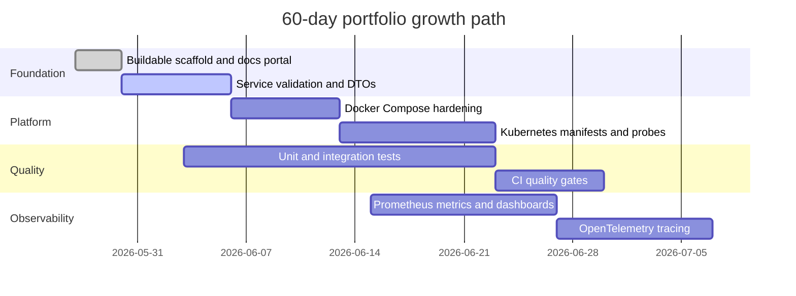

# Roadmap

The project grows through small, reviewable changes so progress remains visible
without sacrificing code quality.

## Near-Term Backlog

| Priority | Improvement |
| --- | --- |
| 1 | Completed: add DTOs and validation to account and payment APIs |
| 2 | Completed: add service-layer boundaries before controllers call repositories |
| 3 | In progress: account and payment H2 coverage complete; transaction persistence coverage next |
| 4 | Add idempotency-key handling for payment creation |
| 5 | Add OpenAPI YAML and Swagger UI documentation |
| 6 | Add health probes and resource limits to Kubernetes manifests |
| 7 | Add Prometheus dashboard documentation and screenshots |

## Commit Standard

Daily commits should be genuine, focused, and easy to review. A good commit
changes one thing, includes verification notes in the PR, and improves either the
runtime system or the public portfolio story.
