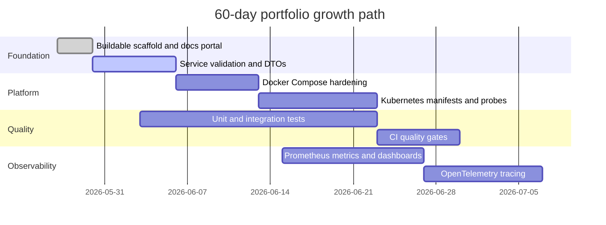

# Roadmap

The project grows through small, reviewable changes so progress remains visible
without sacrificing code quality.

## Near-Term Backlog

| Priority | Improvement |
| --- | --- |
| 1 | Completed: add DTOs and validation to account and payment APIs |
| 2 | Completed: add service-layer boundaries for account, payment, and transaction flows |
| 3 | Completed: add H2 persistence coverage for account, payment, and transaction data |
| 4 | Completed: persist payment event identity and prevent duplicate ledger entries |
| 5 | Completed: add hashed idempotency-key handling for payment creation |
| 6 | Completed: add a transactional outbox with acknowledged Kafka relay |
| 7 | Completed: add capped exponential outbox retry and terminal exhaustion |
| 8 | Completed: add an internal row-locked, audited, idempotent recovery command |
| 9 | Completed: add a fail-closed HTTP Basic operator recovery adapter |
| 10 | Completed: journal business-level recovery rejections without sensitive request data |
| 11 | Add trusted-proxy and external identity integration |
| 12 | Completed: add opt-in bounded retention for published outbox and recovery-audit data |
| 13 | Completed: persist an atomic local dead-letter handoff for each terminal publication cycle |
| 14 | Completed: add HTTPS-only bounded operator inspection for retained handoffs |
| 15 | Add independently available dead-letter delivery and MySQL qualification |
| 16 | Add Swagger UI and expand OpenAPI documentation |
| 17 | Add health probes and resource limits to Kubernetes manifests |
| 18 | Add Prometheus dashboard documentation and screenshots |

## Commit Standard

Daily commits should be genuine, focused, and easy to review. A good commit
changes one thing, includes verification notes in the PR, and improves either the
runtime system or the public portfolio story.
